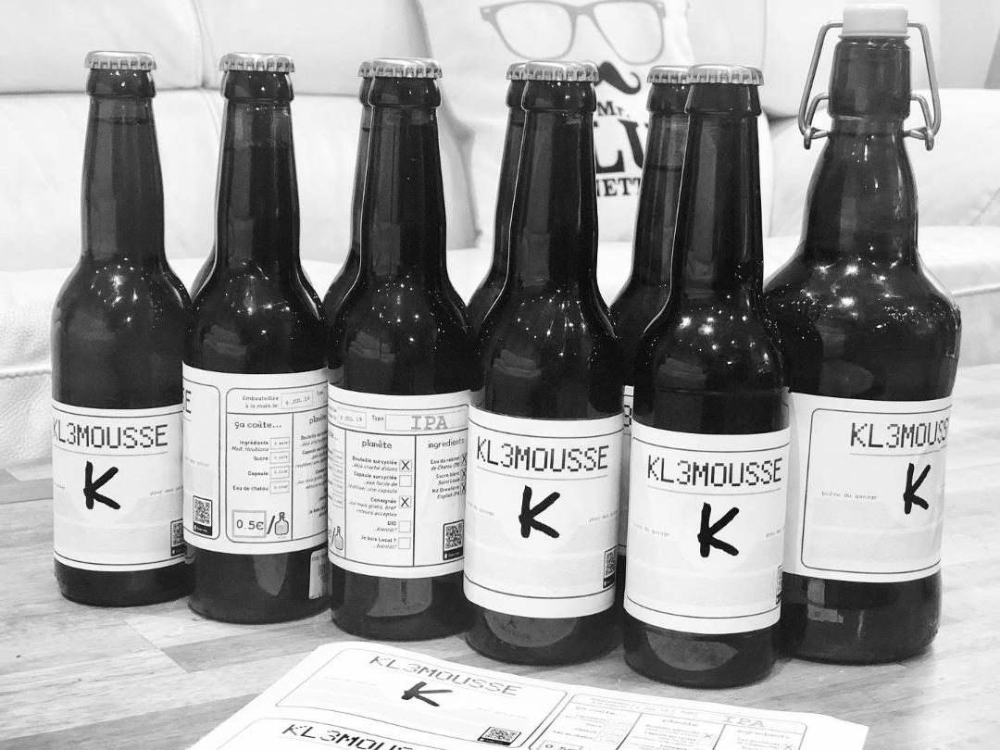
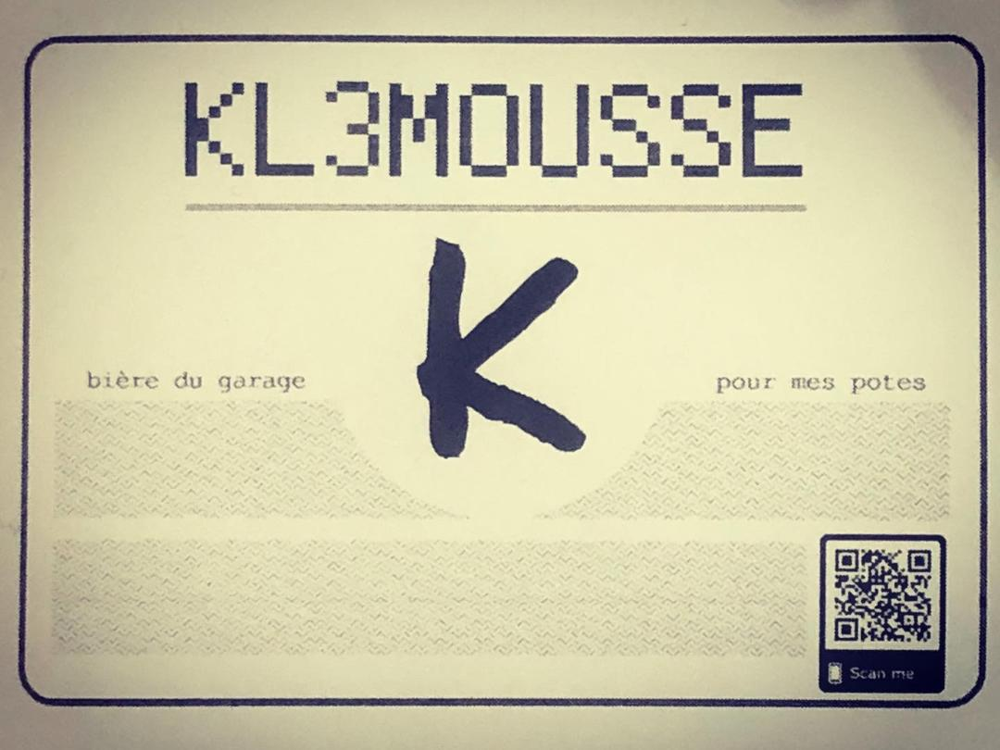
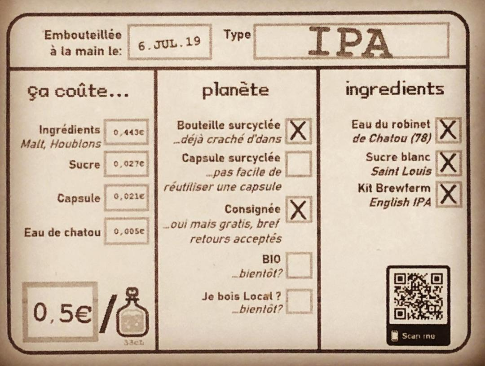

# kl3mousse K
Bière brassée à Chatou (78), France en juillet 2019.

... bouteilles récupérées, nettoyées, étiquettées, encapsulées, et remplies avec de la bière IPA en kit brewferm (melasse de malt et houblons, levures de bière) à faire chez soi, avec un peu d'eau du robinet (10-11 litres), et de sucre (presque 1kg).

---

---

---
