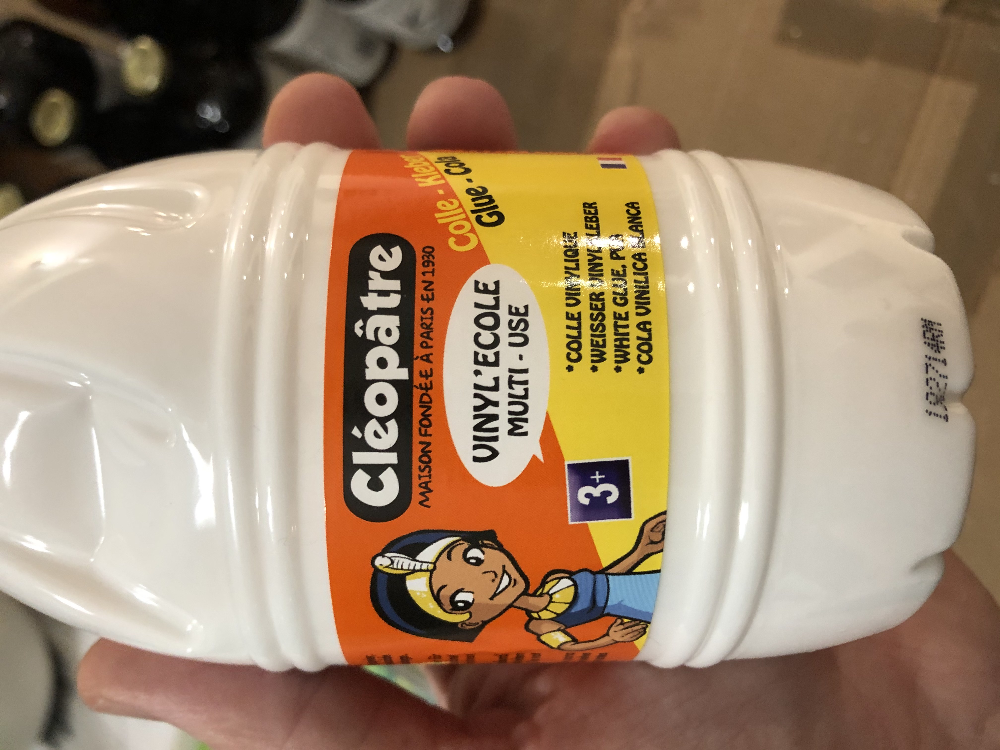

# kl3mousse K
Bière brassée à Chatou (78), France fin 2019 (embouteillage le 5/12/2019).

... bouteilles récupérées, nettoyées, étiquettées, encapsulées, et remplies avec de la bière APA en kit Copper (melasse de malt et houblons, levures de bière) à faire chez soi, avec un peu d'eau du robinet (21-22 litres), et de sucre (presque 1kg).

---

fabriquée en papier :

collée avec sa colle Cléopatre :

---
Les ingrédients

---
Un grand merci aux fournisseurs de bouteilles:

